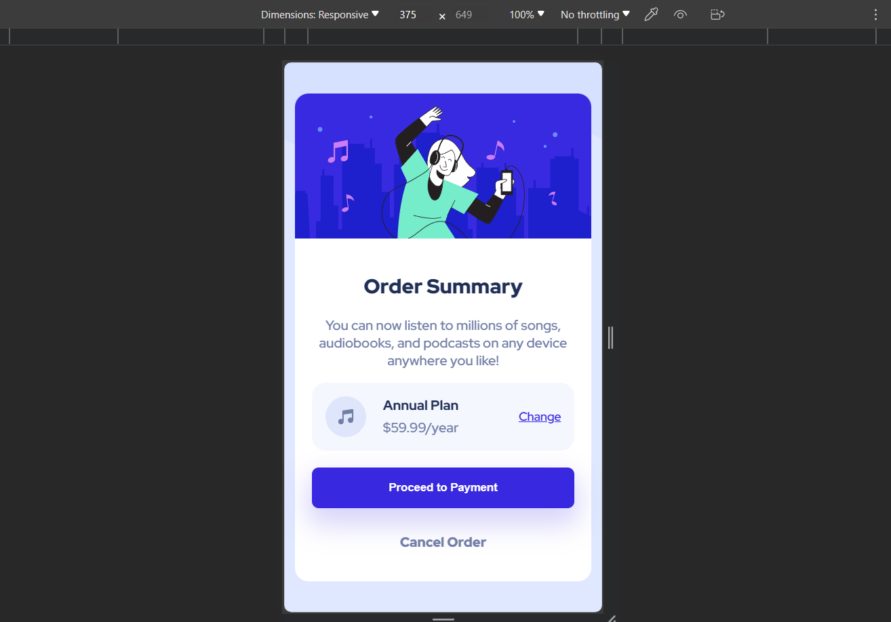

# Frontend Mentor - Order summary card solution

This is a solution to the [Order summary card challenge on Frontend Mentor](https://www.frontendmentor.io/challenges/order-summary-component-QlPmajDUj). Frontend Mentor challenges help you improve your coding skills by building realistic projects.

## Table of contents

- [Overview](#overview)
  - [Screenshot](#screenshot)
  - [Links](#links)
- [My process](#my-process)
  - [Built with](#built-with)
- [Author](#author)

**Note: Delete this note and update the table of contents based on what sections you keep.**

## Overview

### Screenshot

### Links

- Solution URL: [Solution URL](https://github.com/NiroopR1999/Order-Summary-Component)
- Live Site URL: [Live site URL]https://niroopr1999.github.io/Order-Summary-Component/)

## My process

### Built with

- Sass
- Mobile-first workflow
- [Vite React](https://vitejs.dev/) - JS library

## Author

- GitHub - [Niroop R](https://github.com/NiroopR1999)
- Frontend Mentor - [@NiroopR1999](https://www.frontendmentor.io/profile/NiroopR1999)
